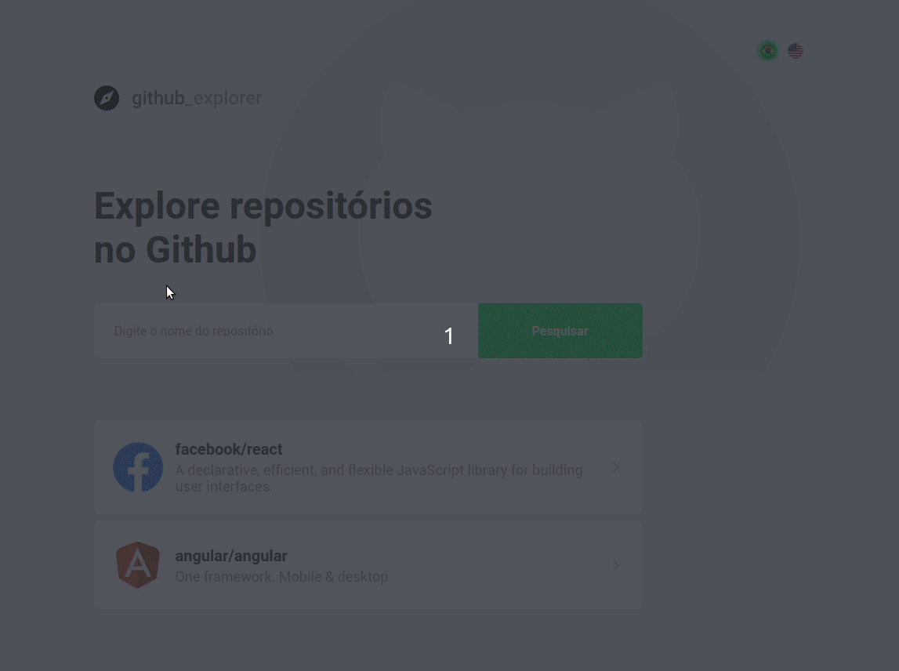

<h1 align="center">
 GitHub Explorer
</h1>

<p align="center">
 
</p>

<h3 align="center">
 Explore repositórios de forma simples!
</h3>

<p align="center">
      
      
      
      
  </p>

<p align="center">
  <a href="#rocket-sobre-o-projeto">Sobre o projeto</a> | <a href="#computer-tecnologias">Tecnologias</a> | <a href="#books-guia-de-instalação-e-execução">Guia de instalação e execução</a> | <a href="#scroll-licença">Licença</a>
</p>

## Layout


## :rocket: Sobre o projeto

<p>Este é um app para explorar repositórios no GitHub deixando sua pesquisa mais facíl e interativa.</p>
<p>Adicione quantos repositórios quiser e tenha fácil acesso as principais informações e issues abertas.</p>

<strong>Funcionalidades inseridas :rocket: </strong>

- [X] Internacionalização
- [ ] Tema Dark

## :computer: Tecnologias

- ReactJS
- Typescript
- ESLint
- Prettier
- React Router DOM
- React Navigation
- Styled Components
- Axios
- React intl universal

## :books: Guia de instalação e execução

### Pré-requisitos

- Yarn ou npm
- PostgreSQL

### Como executar

```bash
# Clone este repositório e acesse a pasta
$git clone https://github.com/Gilles30/git-explorer-gostack.git && cd git-explorer-gostack

# Instale as dependencias com yarn OU
$yarn

# Instale as dependencias com npm
$npm install

# Instale as dependencias do react-itl-universal
$yarn add react-intl-universal

# Rode a aplicação com o comando de acordo com seu gerenciador de pacotes
$yarn start

# OU
$npm start

# Pronto, a aplicação está rodando! Acesse http://localhost:3000 no browser.
```

## :scroll: Licença

Esse projeto está sob a licença MIT. Veja o arquivo <a href="https://github.com/Gilles30/git-explorer-gostack/LICENSE">LICENSE</a> para mais detalhes.

<hr />
<p>by Lorison Gilles :wave: <a href="https://www.linkedin.com/in/lorison-gilles/">Get in touch!</a></p>
